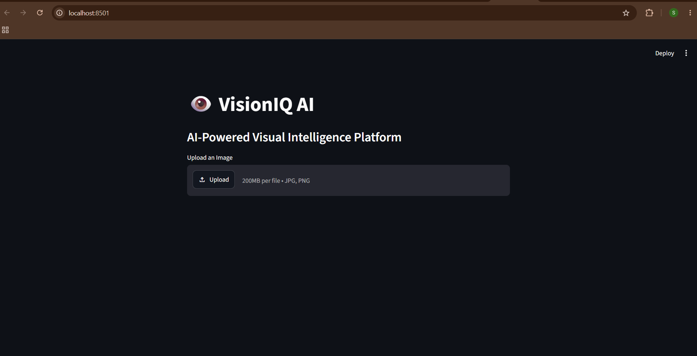
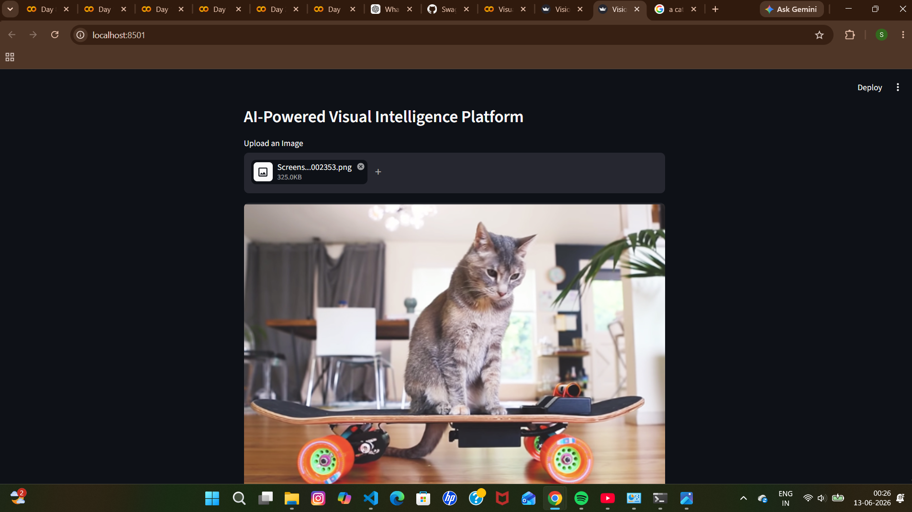
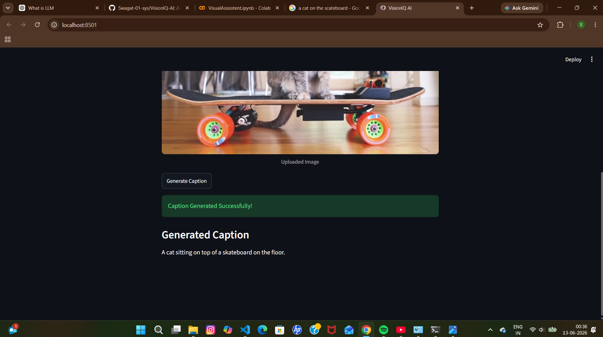

# 👁️ VisionIQ AI

AI-Powered Visual Intelligence Platform built using Microsoft's Florence-2 Foundation Model and Streamlit.

---

## 🚀 Overview

VisionIQ AI is a multimodal computer vision application that enables users to upload images and generate intelligent captions using Florence-2, a powerful vision-language model developed by Microsoft.

The project demonstrates the integration of Generative AI, Computer Vision, and modern web technologies to build an interactive AI-powered visual understanding system.

---

## ✨ Features

* 🖼️ Image Upload Interface
* 🤖 AI-Powered Image Caption Generation
* ⚡ Real-Time Processing with Florence-2
* 🎨 Interactive Streamlit Web UI
* 🧠 Vision-Language Model Integration
* 📷 Support for JPG, JPEG, and PNG Images

---

## 🛠️ Tech Stack

### Frontend

* Streamlit

### Backend

* Python

### AI / Machine Learning

* Florence-2 Base
* Hugging Face Transformers
* PyTorch

### Image Processing

* Pillow (PIL)

---

## 📂 Project Structure

```text
VisionIQ-AI/
│
├── screenshots/
│   ├── homepage.png
│   ├── upload_page.png
│   └── caption_result.png
│
├── app.py
├── requirements.txt
├── README.md
└── .gitignore
```

---

## 📸 Screenshots

### Homepage



### Upload Interface



### Generated Caption



---

## ⚙️ Installation

### Clone Repository

```bash
git clone https://github.com/YOUR_USERNAME/VisionIQ-AI.git
cd VisionIQ-AI
```

### Create Virtual Environment

```bash
python -m venv venv
```

### Activate Environment

#### Windows

```bash
venv\Scripts\activate
```

#### Linux / Mac

```bash
source venv/bin/activate
```

### Install Dependencies

```bash
pip install -r requirements.txt
```

### Run Application

```bash
python -m streamlit run app.py
```

---

## 🎯 Sample Use Case

1. Upload an image.
2. Click **Generate Caption**.
3. Florence-2 analyzes the image.
4. The AI generates a natural language description of the image.

---

## 🔮 Future Enhancements

* 🎯 Object Detection
* 📄 OCR (Optical Character Recognition)
* 🔍 Detailed Image Analysis
* 🎥 Video Understanding
* ☁️ Cloud Deployment
* 🌐 Multi-language Caption Generation

---

## 💡 Key Learnings

* Hugging Face Transformers
* Vision-Language Models
* Streamlit Deployment
* Florence-2 Integration
* AI Application Development
* Python Environment Management

---

## 👨‍💻 Author

**SWAGATA CHOWDHURY**

Computer Science & Engineering Student
Passionate about Artificial Intelligence, Generative AI, Machine Learning, and Software Engineering.

---

⭐ If you found this project interesting, consider giving it a star on GitHub!
